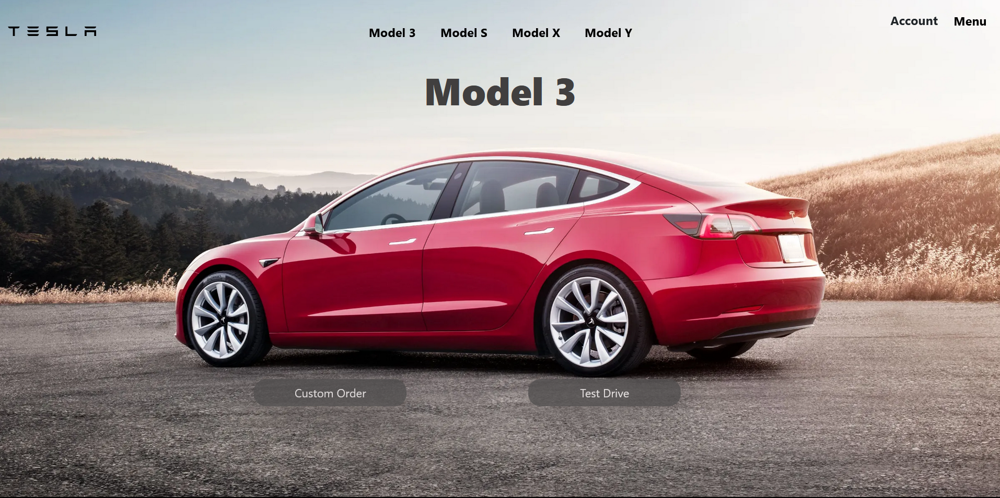
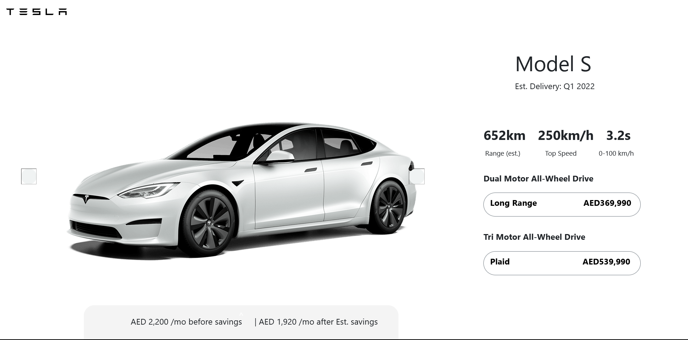
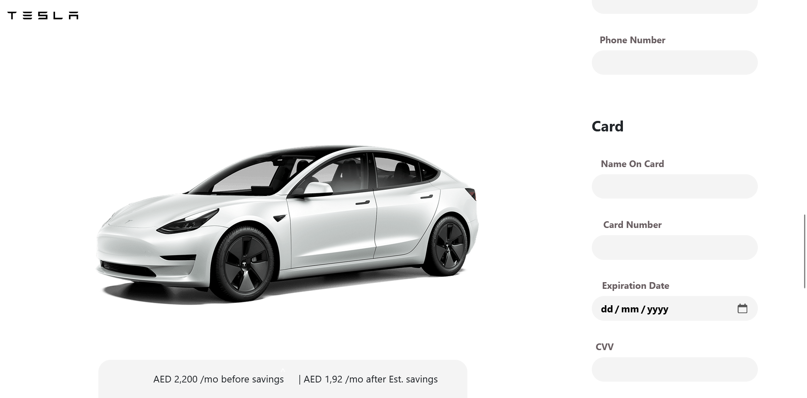

# Tesla E-Commerce Website Simulation

## Project Overview

This project aims to simulate a car purchasing e-commerce website similar to Tesla. It encompasses user creation and authentication, car customization, purchasing, and data storage using a MySQL database.







### Backend

The backend is powered by a Flask API, handling user information such as usernames, addresses, card details, and Tesla car customization details. All sensitive data is securely hashed and stored in a MySQL database.

### Frontend

The frontend is developed using a combination of JavaScript, HTML, and CSS to create an intuitive and visually appealing user interface.

## Features

- **User Authentication:**

  - Create and authenticate user accounts securely.
  - Store user information, including addresses and card details.

- **Car Customization:**
  - Allow users to customize Tesla cars according to their preferences.
- **Purchase Process:**

  - Enable users to navigate through the purchasing process seamlessly.

- **Database Storage:**
  - Utilize a MySQL database to store hashed user data securely.

## Technologies Used

- **Backend:**

  - Flask (Python)

- **Frontend:**

  - JavaScript
  - HTML/CSS

- **Database:**
  - MySQL

## How to Run the Project

1. **Clone the Repository:**

   ```bash
   git clone https://github.com/prerak77/Tesla_Clone.git
   cd Tesla_Clone
   ```

2. **Set Up the Backend:**

   - Install the required dependencies using `pip install -r requirements.txt`.
   - Configure the MySQL database settings.

3. **Run the Flask Application:**

   ```bash
   python app.py
   ```

4. **Access the Frontend:**
   - Open the `index.html` file in your browser.

## Contribution Guidelines

Feel free to contribute to the project by following these guidelines:

- Fork the repository.
- Create a new branch for your feature or bug fix.
- Submit a pull request.
